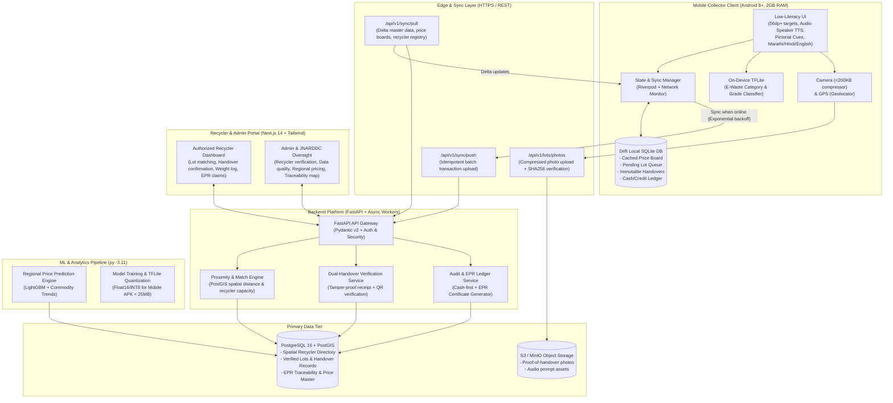

# Kabadiwala Connect

**Smart India Hackathon Problem Statement 26229**  
**Nodal Agency**: Ministry of Mines / Jawaharlal Nehru Aluminium Research Development and Design Centre (JNARDDC)  
**Domain**: Clean & Green Technology / Informal Sector Circular Economy  

---

## 1. Problem Summary

Over 90% of India's electronic waste is processed in the informal economy by hundreds of thousands of informal waste collectors (*kabadiwalas*) using crude, dangerous methods such as open acid leaching and wire burning. Under India's **E-Waste (Management) Rules 2022**, authorized recyclers must meet stringent Extended Producer Responsibility (EPR) recycling targets but lack direct, transparent supply chain access to this informal base. **Kabadiwala Connect** bridges this gap through a vernacular, low-literacy, offline-tolerant mobile platform and web portal. It empowers grassroots collectors with real-time fair price discovery, AI-assisted scrap classification, offline-resilient digital ledgers, and tamper-evident dual handover verification—routing e-waste safely into the formal circular economy while boosting grassroots livelihoods.

---

## 2. System Architecture



---

## 3. Quickstart & Setup (Under 10 Steps)

Ensure you have **Python 3.11**, **Node.js 18+**, and **Flutter 3.x** installed.

```bash
# 1. Clone the repository
git clone https://github.com/your-org/kabadiwala-connect.git
cd kabadiwala-connect

# 2. Set up Python virtual environment
py -3.11 -m venv .venv
.\.venv\Scripts\activate

# 3. Install backend & ML dependencies
pip install -r backend/requirements.txt
pip install -r ml/requirements.txt

# 4. Seed demo dataset (Recyclers, 60-day price trends, collectors, safety cards)
py -3.11 backend/app/data_pipeline/demo_seed.py

# 5. Run backend server (Runs on port 8000)
cd backend && py -3.11 -m uvicorn app.main:app --reload --port 8000 &
cd ..

# 6. Install portal dependencies & start Next.js web portal (Runs on port 3000)
cd portal && npm install && npm run dev &
cd ..

# 7. Get Flutter mobile dependencies
cd mobile && flutter pub get

# 8. Run Flutter mobile client (Chrome, Emulator, or connected Android phone)
flutter run -d chrome
```

---

## 4. Documentation Links

- **Compliance Matrix**: [docs/PS_COMPLIANCE.md](file:///c:/dev/kabadiwala-connect/docs/PS_COMPLIANCE.md)
- **Architecture**: [docs/ARCHITECTURE.md](file:///c:/dev/kabadiwala-connect/docs/ARCHITECTURE.md)
- **Unit Economics**: [docs/UNIT_ECONOMICS.md](file:///c:/dev/kabadiwala-connect/docs/UNIT_ECONOMICS.md)
- **10-Slide Pitch Outline**: [docs/PITCH_OUTLINE.md](file:///c:/dev/kabadiwala-connect/docs/PITCH_OUTLINE.md)
- **2-Minute Video Script**: [docs/VIDEO_SCRIPT.md](file:///c:/dev/kabadiwala-connect/docs/VIDEO_SCRIPT.md)
- **Performance & Footprint**: [docs/PERF.md](file:///c:/dev/kabadiwala-connect/docs/PERF.md)
- **Known Limitations**: [docs/LIMITATIONS.md](file:///c:/dev/kabadiwala-connect/docs/LIMITATIONS.md)
