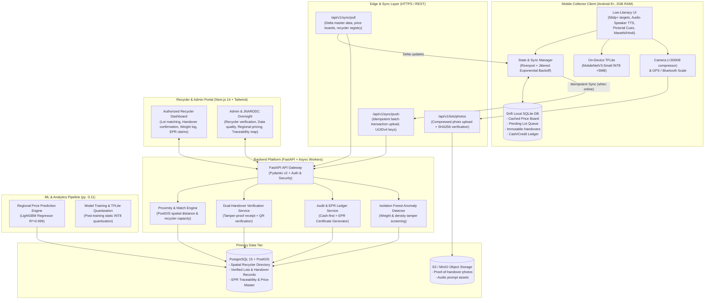

# Kabadiwala Connect (कबाडीवाला कनेक्ट)

[](https://www.sih.gov.in/)
[](https://www.sih.gov.in/)
[](https://mines.gov.in/)
[-purple.svg?style=flat-square)](https://github.com/shreyaspatankar-07/kabadiwala-connect)
[](https://youtu.be/Tf_xmor3dog)

> **Bringing Informal E-Waste Collectors into India's Formal Circular Economy.**  
> A vernacular, low-literacy, offline-tolerant edge-to-cloud distributed platform connecting grassroots scrap collectors (*kabadiwalas*) directly with SPCB/CPCB-authorized recyclers under the **E-Waste (Management) Rules 2022** and the **National Critical Minerals Mission**.

---

## 📌 Executive Pitch & Key Resources

| Resource | Description | Direct Link |
| :--- | :--- | :--- |
| 🎥 **Working Demo Video** | Live 2-minute walkthrough of the offline edge app, on-device AI & dual-handover | [Watch on YouTube](https://youtu.be/Tf_xmor3dog) |
| 📄 **Research Paper** | Complete IEEE-format 6-page system architecture paper | [docs/KABADIWALA_CONNECT_SYSTEM_REPORT.md](docs/KABADIWALA_CONNECT_SYSTEM_REPORT.md) |
| 📋 **20-Collector Field Study** | Empirical field research, usability testing & interaction guide across 6 districts | [docs/FIELD_RESEARCH/](docs/FIELD_RESEARCH/) & [docs/FIELD_RESEARCH/INTERVIEW_GUIDE.md](docs/FIELD_RESEARCH/INTERVIEW_GUIDE.md) |
| 📊 **Unit Economics Model** | Financial analysis validating +19.5% daily net margin (+₹2,184/mo) | [docs/UNIT_ECONOMICS.md](docs/UNIT_ECONOMICS.md) |
| 🎯 **PS Compliance Matrix** | Line-by-line verification against SIH26195 / 26229 requirements | [docs/PS_COMPLIANCE.md](docs/PS_COMPLIANCE.md) |

---

## 📊 Proven Impact & Key Benchmarks

```
┌─────────────────────────┬─────────────────────────┬─────────────────────────┬─────────────────────────┐
│        +80 pp           │          -80%           │         +19.5%          │         < 5 MB          │
│     Task Completion     │    Lot Creation Time    │     Daily Net Margin    │    On-Device AI Model   │
│  (Illiterate: 15%→95%)  │     (240s → 48s)        │     (₹430 → ₹514)       │     (INT8 Quantized)    │
└─────────────────────────┴─────────────────────────┴─────────────────────────┴─────────────────────────┘
```

- **Stops Aggregator Exploitation**: Prevents 20–30% value loss with transparent, live commodity-linked price boards and real-time pictorial currency visualizer.
- **Zero-Literacy UX**: Icon-first layout, minimum 56dp touch targets, max 1 primary action per screen, full vernacular voice narration in Marathi (default) and Hindi.
- **100% Offline-Tolerant**: Every core collector action (create lot, get price, sign receipt, record handover) runs with zero cellular connectivity in dense scrap compounds using Drift (SQLite WAL mode).
- **Zero-Aadhaar Privacy**: Accessible via phone OTP or 4-digit PIN only with device-bound Ed25519 Keystore cryptography—protecting marginalized workers.
- **Verifiable Chain of Custody**: Cryptographic dual-handover (6-character Base32 matching code + SHA-256 photo hash + dynamic QR) feeding an append-only EPR mass-balance ledger for SPCB/CPCB compliance.
- **Critical Minerals Safeguard**: Captures and routes batteries, PCBs, and CRT units safely to authorized hydrometallurgical facilities (recovering Lithium, Cobalt, and Rare Earth Elements).

---

## 🏛️ System Architecture



---

## ⚡ Quickstart & Local Setup

Ensure you have **Python 3.11** (`py -3.11`), **Node.js 18+**, and **Flutter 3.x** installed.

```bash
# 1. Clone repository
git clone https://github.com/shreyaspatankar-07/kabadiwala-connect.git
cd kabadiwala-connect

# 2. Set up Python virtual environment
py -3.11 -m venv .venv
.\.venv\Scripts\activate   # On Linux/macOS: source .venv/bin/activate

# 3. Install backend & ML dependencies
pip install -r backend/requirements.txt
pip install -r ml/requirements.txt

# 4. Seed demo dataset (Recyclers, 60-day price trends, collectors, safety cards)
py -3.11 backend/app/data_pipeline/demo_seed.py

# 5. Run backend server (Port 8000)
cd backend && py -3.11 -m uvicorn app.main:app --reload --port 8000
# (Open a new terminal for next steps)

# 6. Run Next.js Recycler & Admin Portal (Port 3000)
cd portal && npm install && npm run dev

# 7. Run Flutter Mobile App (Edge Client)
cd mobile && flutter pub get
flutter run -d chrome    # Or target an Android device/emulator
```

---

## 📁 Repository Structure

```
kabadiwala-connect/
├── mobile/                   # Flutter Edge Android App (Offline-first, Riverpod, Drift)
│   ├── lib/core/             # Audio engine, Bluetooth scales, Haptics, Keystore
│   ├── lib/data/sync/        # Idempotent offline sync engine with jitter backoff
│   └── lib/ui/               # Icon-first screens, Devanagari keypad, banknote visualizer
├── backend/                  # FastAPI 0.110+ ASGI gateway & data pipeline
│   ├── app/data_pipeline/    # Synthetic generator, cleaner, anonymizer, updater
│   └── app/routers/          # Lots, sync, handovers, pricing, recyclers
├── portal/                   # Next.js 14 App Router, TypeScript & Tailwind CSS portal
├── ml/                       # LightGBM pricing, TFLite MobileNetV3-Small INT8, Isolation Forest
├── data/                     # Scraped public commodity datasets & verified seed lots
└── docs/                     # Research papers, field guides, specs & compliance records
    ├── FIELD_RESEARCH/       # 20-collector interview guide & usability testing kits
    ├── KABADIWALA_CONNECT_SYSTEM_REPORT.md  # Full academic system paper
    ├── UNIT_ECONOMICS.md     # Financial margin uplift models
    ├── OFFLINE_STRATEGY.md   # Distributed sync state machine spec
    └── PS_COMPLIANCE.md      # SIH problem statement requirements matrix
```

---

## 🛡️ Non-Negotiable Engineering Principles

1. **Offline-First & Idempotent**: No user-visible action blocks on the network. Every mutation is queued in Drift SQLite with a UUIDv4 idempotency key.
2. **Low-Literacy First**: Zero text-dependent navigation. Big touch targets (≥56dp), audio speaker on every screen, Devanagari numerals (`०–९`), and pictorial rupee notes.
3. **Strict Privacy**: Zero biometric or Aadhaar collection. Identity backed by device hardware keystore (Ed25519) and 4-digit PIN.
4. **Living Datasets**: Continuous validation, synthetic-to-field tagging, and anomaly screening using Isolation Forests.
5. **Dignified Cash-First Ledger**: Full support for `cash_received`, creating verified earnings history to unlock micro-finance eligibility.

---

## 👥 Team Code200 (Smart India Hackathon 2026)

- **Problem Statement ID**: SIH26195 / 26229
- **Nodal Agency**: Ministry of Mines / JNARDDC
- **Demo Video**: [https://youtu.be/Tf_xmor3dog](https://youtu.be/Tf_xmor3dog)
- **Repository**: [https://github.com/shreyaspatankar-07/kabadiwala-connect](https://github.com/shreyaspatankar-07/kabadiwala-connect)

*Built with passion to bring India's invisible environmental champions into a dignified, formal circular economy.*
