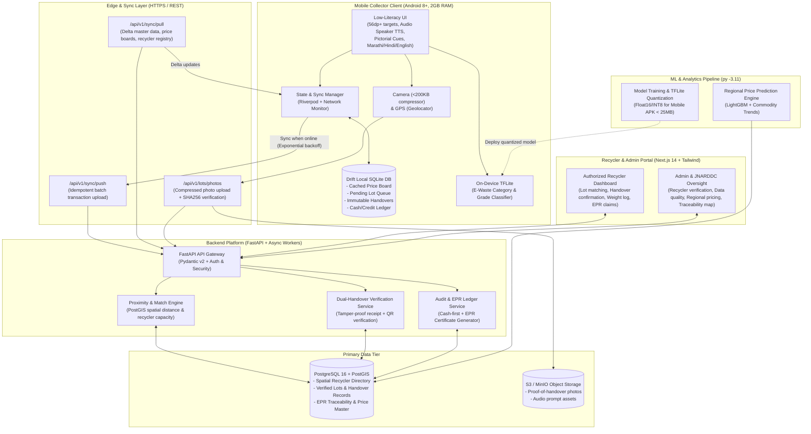

# Architecture Documentation: Kabadiwala Connect

**Kabadiwala Connect** is a vernacular, low-literacy, offline-tolerant platform connecting informal e-waste collectors (*kabadiwalas*) with authorized recyclers under India's **E-Waste (Management) Rules 2022** (SIH Problem Statement 26229 / Ministry of Mines & JNARDDC).

---

## 1. System Overview & Component Diagram

The system comprises five core subsystems designed around offline resilience, low-bandwidth operation, high data traceability, and low-literacy vernacular interactions.

---

## 2. Key Architecture Subsystems

### 2.1 Mobile Application (`/mobile`)
- **Framework:** Flutter 3.47+ (Dart) with Android SDK 36.0.0 target.
- **Offline Storage:** Drift (SQLite wrapper) supporting compile-time query safety, migrations, and reactive queries.
- **State Management:** Riverpod 2.x for modular, testable UI state and background sync dispatchers.
- **Audio Engine:** `audioplayers` or native TTS trigger reading out vernacular screen instructions in Marathi (default), Hindi, and English.
- **On-Device Inference:** TensorFlow Lite runtime for real-time offline classification of e-waste categories (e.g. PCB Grade A/B/C, CRT vs. Flat screen, Lithium-ion batteries) without cloud round-trips.
- **Footprint Budget:**
  - Total APK size: $< 25$ MB.
  - Image compression: Native WebP/JPEG encoding down to $\le 200$ KB before persistence.
  - Cold startup time: $< 3$ seconds on low-end 2GB RAM devices.

### 2.2 API & Sync Service (`/backend`)
- **Runtime:** Python 3.11 (`py -3.11`) using FastAPI with asynchronous endpoints.
- **Validation:** Pydantic v2 schemas for all payloads.
- **Database & Spatial:** SQLAlchemy 2.0 async ORM paired with GeoAlchemy2 and PostgreSQL 16 + PostGIS.
- **Idempotency & Queuing:** Header-based idempotency tokens (`X-Idempotency-Key` / `client_tx_id`) guaranteeing at-most-once execution for handovers, lot entries, and payments.

### 2.3 Recycler & Admin Portal (`/portal`)
- **Framework:** Next.js 14+ (App Router), TypeScript, Tailwind CSS, Lucide icons.
- **Target Users:**
  1. *Authorized Recyclers / Aggregators:* Accept matched e-waste lots, log incoming tare/gross weights, upload compliance proof, verify collector QR handovers.
  2. *Regulators / Admins (JNARDDC / Ministry of Mines):* Verify EPR authorization certificates, inspect regional pricing benchmarks, detect anomalous fraud patterns, and monitor material mass balance.

### 2.4 ML Services & Pipelines (`/ml`)
- **Environment:** Python 3.11 (`py -3.11`), scikit-learn, LightGBM, TensorFlow / Keras.
- **Price Benchmarking:** Dynamic valuation engine trained on commodity indices (copper, gold, aluminium, rare earths) and local market conditions.
- **Model Optimization:** Automated pipeline producing Quantized INT8 `.tflite` models bundled with or downloaded over-the-air into the mobile app.

---

## 3. Data Traceability & EPR Compliance (E-Waste Rules 2022)
1. **Lot Identification:** Every lot is assigned an unforgeable, human-friendly hash ID (e.g. `KAB-202609-8F2A`).
2. **Immutable Handover Chain:**
   - Pre-handover collector photo + on-device timestamp + GPS coordinates.
   - Recycler scan of lot QR or PIN entry.
   - Recycler scale weight confirmation and grade agreement.
   - Cryptographic record hash `SHA256(lot_id + collector_id + recycler_id + weight + timestamp + gps)`.
3. **Audit Readiness:** Every record is stored append-only in Postgres with tamper-evident audit logs to fulfill CPCB / SPCB EPR reporting criteria.
