# Data Dictionary & Schema Specification: Kabadiwala Connect

This document defines the complete relational and spatial database schema for **Kabadiwala Connect**, supporting Smart India Hackathon PS 26229 (Ministry of Mines / JNARDDC) and compliance with India's **E-Waste (Management) Rules 2022**.

---

## 1. Entity-Relationship (ER) Diagram

```mermaid
erDiagram
    COLLECTORS ||--o{ TRANSACTIONS : creates
    COLLECTORS ||--o{ LEDGER_ENTRIES : owns
    RECYCLERS ||--o{ PRICES : quotes
    RECYCLERS ||--o{ TRANSACTIONS : receives
    TRANSACTIONS ||--o{ TRACEABILITY : logs
    TRANSACTIONS ||--o{ LEDGER_ENTRIES : settles

    COLLECTORS {
        string collector_id PK "KC-C-xxxx (Generated ID, No Aadhaar/Name)"
        enum preferred_language "mr | hi | en"
        string operating_area "District only"
        timestamp created_at "Audit creation timestamp"
    }

    MATERIALS {
        uuid id PK
        string category "e.g. pcb, battery, display"
        string sub_category "e.g. grade_a, li_ion, crt"
        text description "Detailed description"
        string image_ref "Reference image URL/storage key"
        float approx_weight_kg "Typical unit weight"
        enum condition "working | broken | damaged | burnt"
        enum source_type "household | office | shop | repair_unit | other"
        numeric estimated_value "Benchmark valuation (INR)"
        timestamp created_at
        timestamp updated_at
    }

    RECYCLERS {
        string id PK "REC-MH-xxx"
        string name "Legal facility name"
        geometry facility_location "Point(4326) [GiST indexed]"
        jsonb materials_accepted "Array of accepted material categories"
        string authorization_number UK "CPCB/SPCB registration no"
        enum authorization_body "CPCB | SPCB | OTHER"
        enum authorization_status "verified | pending | expired | suspended"
        date authorization_valid_till "EPR validity expiry date"
        string phone "Contact phone"
        jsonb offered_rates "Rates per category"
        boolean pickup_available "True if collector pickup offered"
        float pickup_radius_km "Operating pickup radius"
        jsonb service_area "Geo polygon or district coverage list"
        numeric rating "Quality score 0.0 - 5.0"
        timestamp created_at
        timestamp updated_at
    }

    PRICES {
        uuid id PK
        string category "E-waste category"
        string sub_category "Sub-category"
        string district "Target district"
        string city "Target city"
        geometry location "Point(4326) [GiST indexed]"
        timestamp recorded_at "Price snapshot timestamp"
        numeric buying_price "Current buying rate"
        numeric selling_quoted_price "Selling quote"
        enum unit "kg | piece"
        numeric market_min "Statutory / market minimum"
        numeric market_max "Statutory / market maximum"
        string recycler_id FK "Quoting recycler (nullable)"
        enum source "recycler_quote | field_survey | synthetic"
        timestamp created_at
    }

    TRANSACTIONS {
        string lot_id PK "KC-MH-2609-00123 (Human-friendly ref)"
        string collector_id FK "Originating collector"
        string category "E-waste category"
        numeric weight_kg "Estimated / measured lot weight (>0)"
        numeric quoted_price "Initial quote (INR)"
        numeric final_price "Agreed settlement price (INR)"
        string recycler_id FK "Matched / assigned recycler"
        geometry collection_location "Point(4326) [GiST indexed]"
        geometry handover_location "Point(4326) [GiST indexed]"
        timestamp created_at "Lot generation timestamp"
        timestamp handover_at "Physical handover timestamp"
        enum payment_status "cash_received | pending | digital_paid"
        enum transaction_status "draft | listed | matched | handover_pending | handed_over | confirmed | disputed | cancelled"
        boolean anomaly_flag "Fraud / weight mismatch alert"
        string anomaly_reason "Details of triggered anomaly"
        timestamp updated_at
    }

    TRACEABILITY {
        uuid id PK
        string lot_id FK "Associated transaction lot"
        jsonb photo_hashes "Array of SHA-256 image hashes"
        numeric weight_kg "Verified scale weight"
        timestamp timestamp "Handover execution timestamp"
        float gps_lat "Latitude"
        float gps_lng "Longitude"
        geometry location "Point(4326) [GiST indexed]"
        string handover_ref_no UK "Cryptographic handover token"
        text qr_payload "Encoded QR token"
        boolean recycler_confirmation "Recycler sign-off"
        timestamp confirmed_at "Sign-off timestamp"
        string confirmed_by "Operator ID / phone"
        enum downstream_status "received | dismantled | processed | certificate_issued"
        string record_hash "SHA-256(current record contents)"
        string prev_hash "SHA-256(previous block record) [Hash-Chained]"
        timestamp created_at
    }

    LEDGER_ENTRIES {
        uuid id PK
        string collector_id FK "Collector owner"
        string lot_id FK "Associated transaction (nullable)"
        enum entry_type "credit | debit"
        numeric amount "Transaction value (>0)"
        enum payment_mode "cash_received | pending | digital_paid"
        string description "Vernacular readable narration"
        numeric balance_after "Running cash/receivable balance"
        timestamp recorded_at "Event timestamp"
        timestamp created_at
    }

    SAFETY_CONTENT {
        string id PK "SAFE-BATT-01"
        string category "E-waste category"
        enum hazard_level "info | warning | danger"
        string pictogram_url "Asset path or CDN URL"
        jsonb audio_prompt_urls "{'mr': '...', 'hi': '...', 'en': '...'}"
        jsonb title_vernacular "{'mr': '...', 'hi': '...'}"
        jsonb instructions_vernacular "{'mr': '...', 'hi': '...'}"
        jsonb dos "List of safe practices"
        jsonb donts "List of hazardous practices"
        timestamp created_at
    }

    SYNC_QUEUE {
        uuid id PK
        string collector_id "Originating collector"
        string client_tx_id UK "Client UUID idempotency key"
        string action "create_lot | record_handover | record_cash_payment"
        jsonb payload "Transactional operation payload"
        enum status "pending | processing | completed | failed | dead_letter"
        integer attempts "Retry count"
        text last_error "Error stack / message"
        timestamp client_timestamp "Device timestamp"
        timestamp processed_at "Server completion timestamp"
        timestamp created_at
    }

    ML_TRAINING_SAMPLES {
        uuid id PK
        string image_path "Storage path of training photo"
        string label "Classification label (category / grade)"
        numeric weight_kg "Ground truth weight"
        numeric price "Historical ground truth price"
        geometry location "Point(4326) [GiST indexed]"
        enum source "synthetic | field | scraped_public"
        float quality_score "Annotation confidence (0.0 - 1.0)"
        boolean verified "Expert verified ground truth"
        string verified_by "Auditor / expert name"
        timestamp created_at
    }
```

---

## 2. Table Specifications

### 2.1 `collectors`
Stores minimal informal collector profiles under strict privacy constraints (no Aadhaar, no names, no home addresses).

| Column | Type | Constraints | Description |
| :--- | :--- | :--- | :--- |
| `collector_id` | `VARCHAR(32)` | **PRIMARY KEY** | Generated unique ID (e.g. `KC-C-7821`). |
| `preferred_language`| `ENUM('mr', 'hi', 'en')` | `NOT NULL, DEFAULT 'mr'`| Vernacular language preference (Marathi default). |
| `operating_area` | `VARCHAR(100)` | `NOT NULL` | Operating district only (e.g. "Pune", "Thane"). |
| `created_at` | `TIMESTAMPTZ` | `NOT NULL, DEFAULT NOW()`| Profile creation timestamp. |

- **Indexes:** `ix_collectors_collector_id` (B-tree).
- **Mobile Drift Mapping:** `CollectorProfile`.

---

### 2.2 `materials`
Authoritative master catalog of recognized electronic waste equipment and secondary materials.

| Column | Type | Constraints | Description |
| :--- | :--- | :--- | :--- |
| `id` | `UUID` | **PRIMARY KEY** | Unique material identifier. |
| `category` | `VARCHAR(50)` | `NOT NULL, INDEX` | Broad category (e.g. `pcb`, `battery`, `display`). |
| `sub_category` | `VARCHAR(50)` | `NOT NULL, INDEX` | Granular classification (e.g. `grade_a`, `lithium_ion`).|
| `description` | `TEXT` | `NOT NULL` | Plain language / vernacular description. |
| `image_ref` | `VARCHAR(255)`| `NULLABLE` | Standard reference picture of material. |
| `approx_weight_kg` | `FLOAT` | `NOT NULL` | Average unit weight estimate. |
| `condition` | `ENUM` | `NOT NULL` | `working`, `broken`, `damaged`, `burnt`. |
| `source_type` | `ENUM` | `NOT NULL` | `household`, `office`, `shop`, `repair_unit`, `other`. |
| `estimated_value` | `NUMERIC(12, 2)`| `NOT NULL` | Estimated baseline value in INR. |
| `created_at` | `TIMESTAMPTZ` | `NOT NULL, DEFAULT NOW()`| Audit creation timestamp. |
| `updated_at` | `TIMESTAMPTZ` | `NOT NULL, DEFAULT NOW()`| Audit update timestamp. |

- **Indexes:** `ix_materials_category`, `ix_materials_sub_category` (B-tree).
- **Mobile Drift Mapping:** `LocalMaterials`.

---

### 2.3 `recyclers`
Registered and authorized recyclers under CPCB / SPCB EPR directives.

| Column | Type | Constraints | Description |
| :--- | :--- | :--- | :--- |
| `id` | `VARCHAR(36)` | **PRIMARY KEY** | Unique recycler identifier (e.g. `REC-MH-042`). |
| `name` | `VARCHAR(255)`| `NOT NULL` | Registered enterprise name. |
| `facility_location`| `GEOMETRY(Point, 4326)` | `NOT NULL` | GPS location of recycling plant. |
| `materials_accepted`| `JSONB` | `NOT NULL` | Accepted material categories. |
| `authorization_number`| `VARCHAR(100)`| `UNIQUE, NOT NULL` | Official CPCB/SPCB authorization registration code. |
| `authorization_body`| `ENUM` | `NOT NULL` | `CPCB`, `SPCB`, `OTHER`. |
| `authorization_status`| `ENUM` | `NOT NULL, DEFAULT 'pending'`| `verified`, `pending`, `expired`, `suspended`. |
| `authorization_valid_till`| `DATE` | `NOT NULL` | License validity date. |
| `phone` | `VARCHAR(20)` | `NOT NULL` | Operational contact phone. |
| `offered_rates` | `JSONB` | `NOT NULL` | Rate matrix `{ "pcb_grade_a": 160.0, ... }`. |
| `pickup_available`| `BOOLEAN` | `NOT NULL, DEFAULT FALSE`| Collector doorstep pickup availability. |
| `pickup_radius_km`| `FLOAT` | `NOT NULL, DEFAULT 0.0` | Coverage radius in km from facility. |
| `service_area` | `JSONB` | `NOT NULL` | Geo polygon boundary or list of covered districts. |
| `rating` | `NUMERIC(3, 2)`| `CHECK (rating >= 0 AND <= 5)` | Recycler fulfillment & rating. |
| `created_at` | `TIMESTAMPTZ` | `NOT NULL, DEFAULT NOW()`| Audit creation timestamp. |
| `updated_at` | `TIMESTAMPTZ` | `NOT NULL, DEFAULT NOW()`| Audit update timestamp. |

- **Indexes:** `idx_recyclers_facility_location` (**GiST** spatial index).
- **Mobile Drift Mapping:** `CachedRecyclers`.

---

### 2.4 `prices`
Transparent price discovery board recording regional benchmark scrap rates.

| Column | Type | Constraints | Description |
| :--- | :--- | :--- | :--- |
| `id` | `UUID` | **PRIMARY KEY** | Benchmark price record UUID. |
| `category` | `VARCHAR(50)` | `NOT NULL, INDEX` | Material category. |
| `sub_category` | `VARCHAR(50)` | `NULLABLE, INDEX` | Sub-category. |
| `district` | `VARCHAR(100)`| `NOT NULL, INDEX` | Administrative district. |
| `city` | `VARCHAR(100)`| `NULLABLE` | City / Mandi name. |
| `location` | `GEOMETRY(Point, 4326)` | `NOT NULL` | Geo coordinate of market quote. |
| `recorded_at` | `TIMESTAMPTZ` | `NOT NULL, INDEX` | When price observation was logged. |
| `buying_price` | `NUMERIC(10, 2)`| `NOT NULL, CHECK (>= 0)` | Rate offered to collectors. |
| `selling_quoted_price`| `NUMERIC(10, 2)`| `NOT NULL` | Quoted resale rate. |
| `unit` | `ENUM('kg', 'piece')`| `NOT NULL, DEFAULT 'kg'`| Unit of trade. |
| `market_min` | `NUMERIC(10, 2)`| `NOT NULL` | Lower bound benchmark. |
| `market_max` | `NUMERIC(10, 2)`| `NOT NULL` | Upper bound benchmark. |
| `recycler_id` | `VARCHAR(36)` | `NULLABLE, FK(recyclers.id)`| Quoting recycler (if direct quote). |
| `source` | `ENUM` | `NOT NULL, DEFAULT 'synthetic'`| `recycler_quote`, `field_survey`, `synthetic`. |
| `created_at` | `TIMESTAMPTZ` | `NOT NULL, DEFAULT NOW()`| Audit creation timestamp. |

- **Constraints:** `CHECK (market_min <= market_max)`, `CHECK (buying_price >= 0)`.
- **Indexes:** `idx_prices_location` (**GiST** spatial index).
- **Mobile Drift Mapping:** `CachedPrices`.

---

### 2.5 `transactions`
Lifecycle state machine of e-waste lots from offline aggregation through recycler handover.

| Column | Type | Constraints | Description |
| :--- | :--- | :--- | :--- |
| `lot_id` | `VARCHAR(40)` | **PRIMARY KEY** | Human-friendly reference: `KC-MH-2609-00123`. |
| `collector_id` | `VARCHAR(32)` | `NOT NULL, FK(collectors.collector_id)`| Originating collector. |
| `category` | `VARCHAR(50)` | `NOT NULL, INDEX` | Material category. |
| `weight_kg` | `NUMERIC(10, 2)`| `NOT NULL, CHECK (> 0)` | Lot weight in kg. |
| `quoted_price` | `NUMERIC(12, 2)`| `NOT NULL, CHECK (>= 0)`| Estimated / initial quote in INR. |
| `final_price` | `NUMERIC(12, 2)`| `NULLABLE` | Settled final amount in INR. |
| `recycler_id` | `VARCHAR(36)` | `NULLABLE, FK(recyclers.id)`| Assigned authorized recycler. |
| `collection_location`| `GEOMETRY(Point, 4326)` | `NOT NULL` | Location where lot was created. |
| `handover_location` | `GEOMETRY(Point, 4326)` | `NULLABLE` | Location where handover was conducted. |
| `created_at` | `TIMESTAMPTZ` | `NOT NULL, INDEX` | Lot creation timestamp. |
| `handover_at` | `TIMESTAMPTZ` | `NULLABLE` | Physical handover timestamp. |
| `payment_status` | `ENUM` | `NOT NULL, DEFAULT 'pending'`| `cash_received`, `pending`, `digital_paid`. |
| `transaction_status`| `ENUM` | `NOT NULL, DEFAULT 'draft'` | `draft`, `listed`, `matched`, `handover_pending`, `handed_over`, `confirmed`, `disputed`, `cancelled`. |
| `anomaly_flag` | `BOOLEAN` | `NOT NULL, DEFAULT FALSE` | Flagged if weight/price deviates $> 20\%$. |
| `anomaly_reason` | `VARCHAR(255)`| `NULLABLE` | Explanation of flagged anomaly. |
| `updated_at` | `TIMESTAMPTZ` | `NOT NULL, DEFAULT NOW()`| Audit update timestamp. |

- **Indexes:** `idx_transactions_collection_location` (**GiST**), `idx_transactions_handover_location` (**GiST**).
- **Mobile Drift Mapping:** `LocalTransactions`.

---

### 2.6 `traceability`
Tamper-evident, hash-chained custody logs fulfilling EPR audit trails.

| Column | Type | Constraints | Description |
| :--- | :--- | :--- | :--- |
| `id` | `UUID` | **PRIMARY KEY** | Traceability record UUID. |
| `lot_id` | `VARCHAR(40)` | `NOT NULL, FK(transactions.lot_id)`| Linked lot reference. |
| `photo_hashes` | `JSONB` | `NOT NULL` | SHA-256 hashes of handover photos. |
| `weight_kg` | `NUMERIC(10, 2)`| `NOT NULL` | Certified scale weight. |
| `timestamp` | `TIMESTAMPTZ` | `NOT NULL, INDEX` | Exact timestamp of handover. |
| `gps_lat` | `FLOAT` | `NOT NULL` | WGS84 Latitude. |
| `gps_lng` | `FLOAT` | `NOT NULL` | WGS84 Longitude. |
| `location` | `GEOMETRY(Point, 4326)` | `NOT NULL` | PostGIS spatial point. |
| `handover_ref_no` | `VARCHAR(64)` | `UNIQUE, NOT NULL` | Cryptographic handover receipt code. |
| `qr_payload` | `TEXT` | `NOT NULL` | Scannable QR verification payload. |
| `recycler_confirmation`| `BOOLEAN`| `NOT NULL, DEFAULT FALSE`| Dual-confirmation flag from recycler. |
| `confirmed_at` | `TIMESTAMPTZ` | `NULLABLE` | Timestamp of recycler verification. |
| `confirmed_by` | `VARCHAR(100)`| `NULLABLE` | Recycler operator username or badge ID. |
| `downstream_status`| `ENUM` | `NOT NULL, DEFAULT 'received'`| `received`, `dismantled`, `processed`, `certificate_issued`. |
| `record_hash` | `VARCHAR(64)` | `NOT NULL, INDEX` | SHA-256 hash of this record. |
| `prev_hash` | `VARCHAR(64)` | `NOT NULL` | Previous block record hash (chain). |
| `created_at` | `TIMESTAMPTZ` | `NOT NULL, DEFAULT NOW()`| Audit creation timestamp. |

- **Indexes:** `idx_traceability_location` (**GiST** spatial index).
- **Mobile Drift Mapping:** `LocalTraceability`.

---

### 2.7 `ledger_entries`
Cash-first running ledger for informal collectors.

| Column | Type | Constraints | Description |
| :--- | :--- | :--- | :--- |
| `id` | `UUID` | **PRIMARY KEY** | Ledger entry UUID. |
| `collector_id` | `VARCHAR(32)` | `NOT NULL, FK(collectors.collector_id)`| Owning collector. |
| `lot_id` | `VARCHAR(40)` | `NULLABLE, FK(transactions.lot_id)`| Linked lot (if payment for e-waste). |
| `entry_type` | `ENUM('credit', 'debit')`| `NOT NULL` | Credit (earnings) or Debit. |
| `amount` | `NUMERIC(12, 2)`| `NOT NULL, CHECK (>= 0)` | Transaction value in INR. |
| `payment_mode` | `ENUM` | `NOT NULL, DEFAULT 'cash_received'`| `cash_received`, `pending`, `digital_paid`. |
| `description` | `VARCHAR(255)`| `NOT NULL` | Vernacular readable description. |
| `balance_after` | `NUMERIC(12, 2)`| `NOT NULL` | Resulting ledger balance. |
| `recorded_at` | `TIMESTAMPTZ` | `NOT NULL, INDEX` | Ledger event timestamp. |
| `created_at` | `TIMESTAMPTZ` | `NOT NULL, DEFAULT NOW()`| Audit creation timestamp. |

- **Mobile Drift Mapping:** `LocalLedger`.

---

### 2.8 `safety_content`
Vernacular audio-visual safety cards for dismantling precautions and toxic materials.

| Column | Type | Constraints | Description |
| :--- | :--- | :--- | :--- |
| `id` | `VARCHAR(32)` | **PRIMARY KEY** | Card code (e.g. `SAFE-BATT-01`). |
| `category` | `VARCHAR(50)` | `NOT NULL, INDEX` | Material category. |
| `hazard_level` | `ENUM('info', 'warning', 'danger')`| `NOT NULL, DEFAULT 'info'`| Severity level. |
| `pictogram_url` | `VARCHAR(255)`| `NOT NULL` | High-contrast visual illustration. |
| `audio_prompt_urls`| `JSONB` | `NOT NULL` | Audio clips `{ "mr": "...", "hi": "..." }`. |
| `title_vernacular` | `JSONB` | `NOT NULL` | Title strings in Marathi/Hindi. |
| `instructions_vernacular`| `JSONB` | `NOT NULL` | Safe handling instructions. |
| `dos` | `JSONB` | `NOT NULL` | Safe practices list. |
| `donts` | `JSONB` | `NOT NULL` | Hazardous practices list. |
| `created_at` | `TIMESTAMPTZ` | `NOT NULL, DEFAULT NOW()`| Audit creation timestamp. |

- **Mobile Drift Mapping:** `CachedSafetyContent`.

---

### 2.9 `sync_queue`
Server-side idempotent ingest queue tracking transactions uploaded by offline devices.

| Column | Type | Constraints | Description |
| :--- | :--- | :--- | :--- |
| `id` | `UUID` | **PRIMARY KEY** | Queue item UUID. |
| `collector_id` | `VARCHAR(32)` | `NOT NULL, INDEX` | Submitting collector. |
| `client_tx_id` | `VARCHAR(64)` | `UNIQUE, NOT NULL, INDEX` | Client-generated UUID (Idempotency key). |
| `action` | `VARCHAR(50)` | `NOT NULL, INDEX` | `create_lot`, `record_handover`, `record_cash_payment`. |
| `payload` | `JSONB` | `NOT NULL` | Transaction payload. |
| `status` | `ENUM` | `NOT NULL, DEFAULT 'pending'`| `pending`, `processing`, `completed`, `failed`, `dead_letter`.|
| `attempts` | `INTEGER` | `NOT NULL, DEFAULT 0` | Ingest retry attempts. |
| `last_error` | `TEXT` | `NULLABLE` | Error stack / reason if failed. |
| `client_timestamp`| `TIMESTAMPTZ` | `NOT NULL` | Client device timestamp at creation. |
| `processed_at` | `TIMESTAMPTZ` | `NULLABLE` | Timestamp when successfully reconciled. |
| `created_at` | `TIMESTAMPTZ` | `NOT NULL, DEFAULT NOW()`| Audit creation timestamp. |

- **Mobile Drift Mapping:** `SyncQueueEntries`.

---

### 2.10 `ml_training_samples`
Continuously gathered and annotated image samples for on-device TFLite quantization and price modeling.

| Column | Type | Constraints | Description |
| :--- | :--- | :--- | :--- |
| `id` | `UUID` | **PRIMARY KEY** | Sample UUID. |
| `image_path` | `VARCHAR(255)`| `NOT NULL` | Storage URL / path of e-waste image. |
| `label` | `VARCHAR(50)` | `NOT NULL, INDEX` | Category / grade classification label. |
| `weight_kg` | `NUMERIC(10, 2)`| `NULLABLE` | Ground-truth weight. |
| `price` | `NUMERIC(10, 2)`| `NULLABLE` | Ground-truth benchmark price. |
| `location` | `GEOMETRY(Point, 4326)` | `NULLABLE` | Geographic origin of sample. |
| `source` | `ENUM` | `NOT NULL, DEFAULT 'synthetic'`| Provenance: `synthetic`, `field`, `scraped_public`.|
| `quality_score` | `FLOAT` | `NOT NULL, DEFAULT 1.0` | Annotation confidence metric. |
| `verified` | `BOOLEAN` | `NOT NULL, DEFAULT FALSE`| Expert verification flag. |
| `verified_by` | `VARCHAR(100)`| `NULLABLE` | Expert reviewer ID. |
| `created_at` | `TIMESTAMPTZ` | `NOT NULL, DEFAULT NOW()`| Audit creation timestamp. |

- **Indexes:** `idx_ml_samples_location` (**GiST** spatial index).
- **Mobile Drift Mapping:** `LocalMLSamples`.
