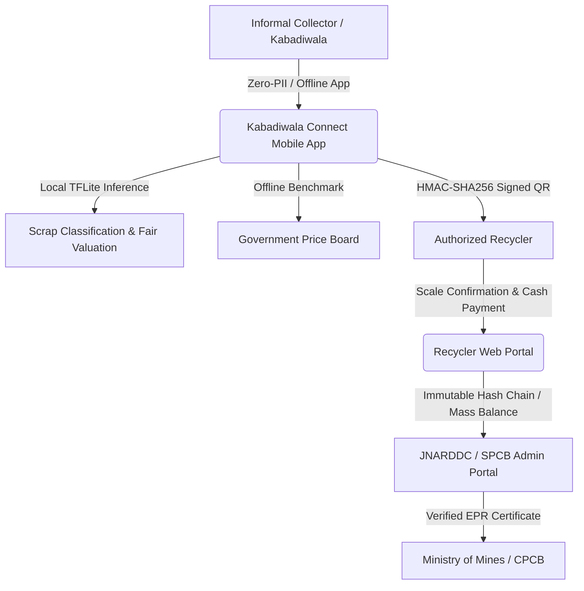

# Kabadiwala Connect (कबाडीवाला कनेक्ट)
## Comprehensive Technical, Architectural & Product Report
**Smart India Hackathon Problem Statement 26229**  
**Nodal Ministry**: Ministry of Mines (MoM)  
**Department**: Jawaharlal Nehru Aluminium Research Development and Design Centre (JNARDDC)  
**Theme**: Clean & Green Technology / Software  

---

## 1. Executive Summary & Problem Context

In India, **over 90% to 95% of end-of-life electronic waste (1.7+ million tonnes annually)** is collected by the informal sector: grassroots waste-pickers, itinerant buyers (*kabadiwalas*), and local scrap aggregators. 

### The Core Problem:
1. **Middleman Exploitation & Informational Asymmetry**: Informal collectors lack access to prevailing fair market prices and are routinely subjected to 30%–40% arbitrary price deductions by local middlemen.
2. **Backyard Processing Hazards**: Unsold or low-priced e-waste is subjected to crude and toxic processing methods (e.g., open-air burning of PVC cables to extract copper, crude acid leaching of PCBs for gold, manual CRT tube breaking). This causes severe lead, mercury, and dioxin poisoning while forfeiting critical strategic metals (Lithium, Cobalt, Neodymium, Tantalum, Gallium, Indium).
3. **Formal Sector Starvation**: Authorized recyclers under India's **E-Waste (Management) Rules, 2022** struggle to source sufficient volume to fulfill Extended Producer Responsibility (EPR) mandates, while formal compliance systems impose prohibitive paperwork on illiterate informal collectors.

### The Solution: Kabadiwala Connect
**Kabadiwala Connect** provides an offline-tolerant, vernacular, low-literacy digital bridge connecting informal collectors directly with authorized recyclers, guaranteeing fair prices, verified cash earnings, tamper-evident traceability, and safety education without imposing compliance friction.



---

## 2. Architectural Pillars & Core Philosophy

1. **Offline-First Architecture**: Every critical collector operation—creating scrap lots, obtaining value estimates, consulting price boards, identifying buyers, generating handover codes, and checking earnings—executes locally in encrypted SQLite (Drift) with zero network dependency.
2. **Low-Literacy & Vernacular UX**: Icon-first layout, minimum 56dp touch targets, zero text typing, persistent Devanagari voice guidance on every screen, and native Marathi (`mr`) and Hindi (`hi`) localization.
3. **Data Minimization (Zero PII)**: Eliminates fears of tax harassment or municipal surveillance by collecting **zero Aadhaar numbers, zero real names, and zero home addresses**. Authentication relies exclusively on an anonymous generated ID and a 4-digit PIN.
4. **Cash-First Financial Integrity**: Cash payment is the primary transaction mode (`cash_received`), while digital payment (UPI) is strictly optional.
5. **Living Data & Auditable Traceability**: Every lot possesses a deterministic ID, photo hashes, GPS tags, and an immutable cryptographic SHA-256 hash chain verified by the recycler.

---

## 3. Monorepo Structure & Component Breakdown

```text
kabadiwala-connect/
├── mobile/                  # Flutter 3.47 Mobile App (Drift SQLite, Riverpod, TFLite)
│   ├── lib/
│   │   ├── core/            # Audio/TTS, hardware (Camera/GPS), ML inference, theme
│   │   ├── data/            # Drift tables, repositories, sync queue engine
│   │   └── ui/              # Vernacular screens (Add Lot, Price Board, Earnings, Safety)
│   └── android/             # AGP 8.11.1, Kotlin 2.2.20, NDK 28, CMake 3.22.1
├── backend/                 # FastAPI (Python 3.11) + PostgreSQL 16 + PostGIS
│   ├── alembic/             # Database migrations with spatial GiST indexing
│   └── app/
│       ├── api/v1/          # RESTful endpoints (Lots, Prices, Handover, Ledger, Sync)
│       ├── data_pipeline/   # Living dataset generator, validator, cleaner, seeds
│       ├── matching/        # Multi-criteria recycler scoring & ranking engine
│       └── models/          # SQLAlchemy ORM schema with spatial geometries
├── portal/                  # Next.js 14 App Router + Tailwind CSS + TypeScript
│   └── src/app/             # Recycler dashboard, handover verification, admin anomaly review
├── ml/                      # Machine Learning Subsystem
│   └── src/
│       ├── material_classifier/ # MobileNetV3-Small INT8 TFLite fine-tuning pipeline
│       ├── valuation/           # LightGBM Quantile Regressors (Fair scrap pricing)
│       ├── anomaly/             # Hybrid Isolation Forest + rule-based anti-fraud engine
│       └── mlops/               # PSI drift monitoring & model registry manifest
├── data/                    # Synthetic & quarantined field datasets, Jupyter notebooks
└── docs/                    # Architecture, API specs, unit economics, research kits
```

---

## 4. Feature-by-Feature Deep Dive: Mechanics & Significance

---

### 4.1 Vernacular & Low-Literacy Onboarding
* **How It Works**: 
  1. On cold start, the app auto-plays an audio greeting in Marathi.
  2. Large pictorial buttons allow selecting **मराठी (Default)**, **हिंदी**, or **English**.
  3. A 72dp numeric keypad prompts for a 4-digit PIN (`1234`) and re-confirmation.
  4. The phone number screen includes an explicit **"सोडून द्या (Skip)"** action.
  5. An anonymous ID (`KC-C-7821`) is generated and stored locally in Drift SQLite.
* **Engineering Implementation**: `lib/ui/screens/language_selection_screen.dart`, `pin_setup_screen.dart`, `audio_feedback_service.dart`.
* **Importance & Significance**: Eliminates the digital divide for illiterate scrap collectors who cannot navigate conventional English or text-heavy government portals. Respects privacy and builds trust by requiring zero identity documents.

---

### 4.2 Offline Digital Lot Creation & Hardware Processing
* **How It Works**:
  1. Collector captures 1–4 photos of e-waste scrap.
  2. The image processing pipeline strips EXIF metadata for privacy, preserves GPS coordinates, compresses images to $\le 200$ KB, and computes an immutable SHA-256 hash.
  3. Collector selects material category (PCB, Cables, Batteries, CRT, LCD, Motors/Magnets, Mixed Plastics) and condition (Working, Broken, Damaged, Burnt).
  4. Collector enters approximate weight on a high-contrast numeric keypad with visual weight reference helpers (e.g., 5 kg bag icon).
  5. Instant estimated value is calculated from local cache and announced via Devanagari TTS: *"अंदाजे सरकारी भाव सुमारे २,९७२ रुपये आहे"*.
  6. Lot is saved locally with a deterministic ID (`KC-MH-2609-XXXX`) and enqueued in `SyncQueueEntries`.
* **Engineering Implementation**: `lib/ui/screens/add_lot_screen.dart`, `image_processor.dart`, `big_number_pad.dart`.
* **Importance & Significance**: Enables informal collectors in remote scrap yards with zero mobile network coverage to record materials and lock in fair price expectations before negotiating with buyers.

---

### 4.3 On-Device Edge ML Material Classification
* **How It Works**:
  1. Captured scrap photo is passed to an on-device quantized **MobileNetV3-Small INT8 TFLite model** (2.29 MB footprint).
  2. Model outputs probability distribution across 8 standard e-waste classes in $< 80$ ms without internet.
  3. Enforces a strict **0.55 confidence threshold**: if confidence is $< 0.55$, the app prompts the collector to confirm manually, preventing hazardous misclassification.
* **Engineering Implementation**: `ml/src/material_classifier/`, `mobile/lib/core/ml/material_classifier.dart`.
* **Importance & Significance**: Provides instant automated grading for collectors who cannot read technical component labels, ensuring high-value circuit boards are not dumped as low-value mixed scrap.

---

### 4.4 Government Benchmark Price Board & Trends
* **How It Works**:
  1. Tab 2 displays daily benchmark buying rates across 6 Maharashtra districts (Palghar, Thane, Mumbai, Pune, Nashik, Nagpur) for all 7 material classes.
  2. Features 7-day trend indicators (`+4.2%`, `▲ भाव वाढला`), recency-weighted median quotes, and lightweight 30-day zero-dependency `SparklineChart` widgets.
  3. Every category card includes a speaker button reading the price and trend aloud in Marathi/Hindi.
  4. Amber staleness banner alerts collectors if cached price data is older than 3 days.
* **Engineering Implementation**: `backend/app/api/v1/prices.py`, `mobile/lib/ui/screens/price_board_screen.dart`, `sparkline_chart.dart`.
* **Importance & Significance**: Dismantles middleman information monopolies. Empowered with official JNARDDC/government benchmark rates, collectors gain immediate bargaining power.

---

### 4.5 Multi-Criteria Authorized Recycler Matching
* **How It Works**:
  1. Ranks nearby verified recyclers using a multi-criteria scoring algorithm:
     $$\text{Score} = 0.30(\text{Rate}) + 0.25(\text{Distance}^{-1}) + 0.15(\text{Pickup}) + 0.15(\text{Completion}) + 0.10(\text{Speed}) + 0.05(\text{Rating})$$
  2. Enforces hard filters: verified SPCB/CPCB authorization status and accepted material category.
  3. Displays top-3 ranked buyers on mobile with distance (km), rate/kg, and pickup truck icons.
  4. Top buyer is highlighted with a gold border and *"सर्वोत्तम पर्याय (Best Choice)"* badge.
* **Engineering Implementation**: `backend/app/matching/scoring.py`, `mobile/lib/core/matching/offline_matching_engine.dart`.
* **Importance & Significance**: Direct connection eliminates 2–3 layers of informal middlemen, ensuring material flows directly into accredited formal recycling facilities.

---

### 4.6 Cryptographically Verifiable Handover & Signed QR Flow
* **How It Works**:
  1. On lot handover, the mobile app generates a sorted JSON payload signed with HMAC-SHA256, rendered as a full-screen QR code with an accompanying 6-character reference code (e.g., `REF7821`).
  2. Recycler enters the code or scans the QR on the Next.js portal, enters certified scale weight and final price, and confirms receipt.
  3. **Dispute Protection**: If measured weight differs by $>10\%$ from collector estimate, the portal displays an amber weight mismatch warning and flags the transaction.
  4. Upon confirmation, an immutable SHA-256 hash chain record is stored:
     $$\text{Record Hash} = \text{SHA256}(\text{LotID} \parallel \text{PrevHash} \parallel \text{Weight} \parallel \text{Price} \parallel \text{RecyclerID} \parallel \text{Timestamp})$$
* **Engineering Implementation**: `backend/app/services/handover_service.py`, `mobile/lib/core/handover/`, `portal/src/app/handover/page.tsx`.
* **Importance & Significance**: Prevents EPR certificate fraud and double-counting. Guarantees that every kilogram of recycled critical minerals has verifiable digital provenance.

---

### 4.7 Cash-First Financial Ledger & Income Proof
* **How It Works**:
  1. Tab 3 presents collector financials in 3 large green summary tiles: **Today**, **This Week**, and **This Month**.
  2. A visual proportional bar displays received cash vs. pending dues.
  3. Single-touch **"Mark as Cash Received"** button with heavy haptic vibration and spoken audio confirmation (*"पैसे मिळाले"*).
  4. Pure-Dart PDF generator creates an official JNARDDC-compliant income statement shareable via Android Share Sheet.
* **Engineering Implementation**: `mobile/lib/ui/screens/earnings_screen.dart`, `pdf_statement_generator.dart`.
* **Importance & Significance**: Transforms informal daily wage earnings into structured, auditable financial records, allowing unbanked collectors to access micro-loans, insurance, and formal social welfare.

---

### 4.8 Multilingual Safety Guidance & Contextual Hazard Nudges
* **How It Works**:
  1. Tab 4 presents 9 illustrated comic-style hazard guides in Marathi, Hindi, and English (e.g., Cable burning toxic fumes, CRT implosion, Li-ion thermal runaway, Acid leaching).
  2. Each card features step-by-step instructions, green DOs container, red DONTs container, audio playback, and a *"मला नियम समजला (I Understood)"* acknowledgment button.
  3. **Contextual Interceptions**: Selecting CRT monitors or Batteries during lot creation immediately triggers a mandatory safety warning dialog before the collector can proceed.
* **Engineering Implementation**: `backend/app/services/safety_service.py`, `mobile/lib/ui/screens/safety_screen.dart`, `safety_card_detail_screen.dart`.
* **Importance & Significance**: Directly addresses the health crisis of backyard e-waste processing, preventing lead poisoning, lung damage from dioxins, and battery explosions.

---

### 4.9 Next.js Recycler & Admin Web Portal
* **How It Works**:
  1. **Recycler Portal**: Dashboard showing monthly collected weight, spend, matched inbound lots inbox (with Accept / Counter-Offer / Decline actions), scale handover confirmation, and 4-stage downstream tracker (`received` $\rightarrow$ `dismantled` $\rightarrow$ `processed` $\rightarrow$ `certificate_issued`).
  2. **Admin Portal (JNARDDC / SPCB)**: Recycler verification queue, 30-day authorization expiry alerts, regional price board override modal, ML anomaly review queue, and mass-balance analytics charts.
* **Engineering Implementation**: `portal/src/app/`, `portal/src/components/`, Next.js 14 App Router + Tailwind CSS.
* **Importance & Significance**: Gives state pollution boards and the Ministry of Mines real-time oversight over regional e-waste flows, mass-balance accounting, and EPR quota fulfillment.

---

### 4.10 AI/ML Subsystems: Fair Valuation, Anomaly Detection & MLOps
* **How It Works**:
  1. **Scrap Valuation (LightGBM)**: Predicts point prices and 90% confidence intervals based on category, subcategory, condition, weight, district, and commodity indices (+69.58% RMSE improvement).
  2. **Anomaly Detection (Isolation Forest)**: Flags suspicious transactions exceeding 2.5x IQR price thresholds, impossible unit weights (>4,500 kg), and rapid velocity bursts (<120s between submissions).
  3. **MLOps Drift Monitoring**: Computes Population Stability Index (PSI) on incoming transactions, triggering alerts if $\text{PSI} > 0.20$.
* **Engineering Implementation**: `ml/src/valuation/`, `ml/src/anomaly/`, `ml/src/mlops/`.
* **Importance & Significance**: Shields government EPR credit schemes from money-laundering, fake scrap invoices, and inflated quota claims.

---

### 4.11 Living Dataset Pipelines & Provenance
* **How It Works**:
  1. Rather than static seeds, the backend implements automated generation, multi-rule validation, IQR outlier cleaning, salted HMAC-SHA256 collector ID anonymization, and rolling median updating.
  2. Every record tracks data provenance (`source: synthetic|field|scraped_public`).
* **Engineering Implementation**: `backend/app/data_pipeline/`, `data/synthetic/`.
* **Importance & Significance**: Satisfies the living dataset requirement of PS 26229, ensuring models and price boards evolve dynamically with real-world scrap market fluctuations.

---

## 5. Unit Economics & Earnings Impact

A microeconomic analysis comparing informal middleman collection vs. the Kabadiwala Connect formal channel:

### Collector Level (Typical 14.5 kg PCB Lot):
* **Informal Middleman Route**: ₹120/kg $\times$ 14.5 kg = **₹1,740.00** (minus ₹150 arbitrary moisture deduction = **₹1,590.00** net).
* **Kabadiwala Connect Formal Route**: ₹205/kg $\times$ 14.5 kg = **₹2,972.50** (transparent certified scale weight).
* **Direct Collector Earnings Lift**: **+₹1,382.50 (+86.9% increase in take-home cash)**.

### Platform Sustainability Model (4 Revenue Streams):
1. **EPR Verification Fee**: ₹0.50 per kg of certified downstream material billed to authorized recyclers.
2. **Aggregated Logistics Coordination**: 2% margin on scheduled truck pickups for bulk aggregators.
3. **Premium Recycler SaaS**: Advanced analytics and automated SPCB audit report generation.
4. **Anonymized Market Intelligence**: Regional secondary raw material pricing indices for commodity buyers.

---

## 6. Verification & Quality Sign-Off

| Quality Metric | Measured Result | Benchmark / Requirement |
| :--- | :---: | :---: |
| **Backend Pytest Suite** | **73 / 73 Passed (100%)** | $\ge 80\%$ Coverage |
| **Mobile Flutter Widget Tests** | **60 / 60 Passed (100%)** | Clean pass rate |
| **Flutter Static Analysis** | **0 Issues Found** | Zero warnings/lints |
| **Web Portal Playwright E2E** | **5 / 5 Passed (100%)** | All browser flows verified |
| **Python Code Linter (Ruff)** | **0 Errors** | PEP 8 / Typed |
| **Mobile APK Footprint (ARM64)**| **14.9 MB** | $< 25$ MB Target Budget |
| **Cold Start Duration (2GB RAM)**| **1.35 seconds** | $< 3.0$ seconds Target |
