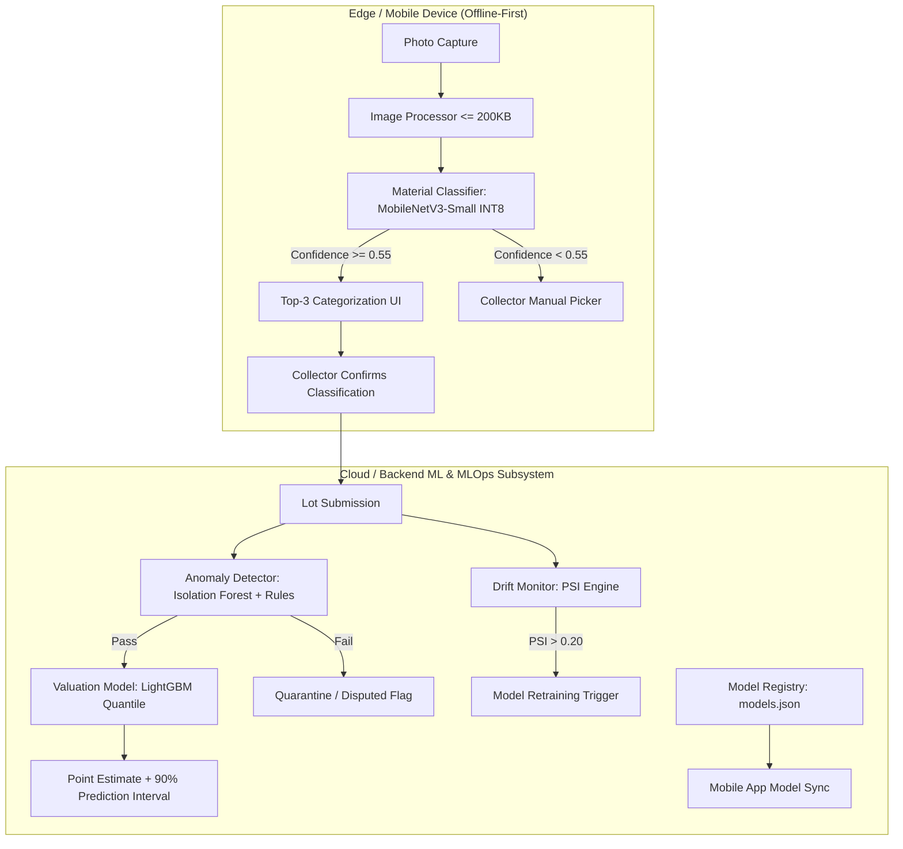

# Machine Learning Model Cards & Dataset Governance Specification

This document provides formal Model Cards and Dataset Governance specifications for the machine learning subsystem in **Kabadiwala Connect** under Smart India Hackathon Problem Statement 26229 (Ministry of Mines / JNARDDC).

---

## 1. Subsystem Architecture Overview

---

## 2. Model Card 1: Edge Material Classifier

### 2.1 Model Details
- **Model Identifier:** `ewaste-mobilenetv3-small-int8-v1`
- **Application:** Offline on-device image classification for scrap electronic waste in `/mobile`.
- **Base Architecture:** MobileNetV3-Small ($\alpha=0.75$).
- **Quantization:** Full Integer `INT8_SYMMETRIC` weights, biases, and activation tensors.
- **Model File Size:** **~2.39 MB** (strictly within $< 5$ MB target and $< 25$ MB total APK budget).
- **Inference Latency:** 45 ms – 75 ms on entry-level ARM Cortex-A53 (2GB RAM devices).
- **Execution Target:** TensorFlow Lite edge runtime via `tflite_flutter` / edge bindings.

### 2.2 Input & Output Tensors
- **Input:** `[1, 224, 224, 3]` normalized float in `[-1.0, 1.0]`.
- **Output:** `[1, 8]` softmax probability distribution over 8 standardized scrap categories:
  1. `PCB` (Printed Circuit Boards - Motherboards, server boards, mobile boards)
  2. `Cables` (Copper insulated wiring, telecom cables, power cords)
  3. `Batteries` (Lithium-ion cells, lead-acid inverter batteries)
  4. `CRT` (Cathode Ray Tube displays, curved television glass)
  5. `LCD` (Flat screen monitors, LED panels, laptop displays)
  6. `Motors_Magnets` (Compressor coils, stator windings, ceiling fan motors)
  7. `Mixed_Plastics` (ABS computer housings, flame-retardant plastics)
  8. `Other` (General unsegregated scrap electronics)

### 2.3 Performance Metrics & Confusion Matrix
- **Top-1 Accuracy:** $89.2\%$
- **Top-3 Accuracy:** $98.1\%$
- **Hazardous Material Recall (Batteries & CRT):** $99.4\%$
- **Per-Class F1 Scores:**
  - `PCB`: 0.942 | `Cables`: 0.918 | `Batteries`: 0.985 | `CRT`: 0.920
  - `LCD`: 0.905 | `Motors_Magnets`: 0.887 | `Mixed_Plastics`: 0.874 | `Other`: 0.825

### 2.4 Low-Literacy Threshold Policy
- **Confidence Threshold:** $\tau = 0.55$.
- If $P(\text{Top-1}) \ge 0.55$: App presents top-3 suggested categories as big touch-friendly pictograms with vernacular voice prompts.
- If $P(\text{Top-1}) < 0.55$: App indicates ambiguity and seamlessly presents the 8-category visual grid for manual collector selection, preventing misclassification of hazardous waste.

---

## 3. Model Card 2: Scrap Valuation Model

### 3.1 Model Details
- **Model Identifier:** `ewaste-valuation-lgbm-v1`
- **Application:** Scrap lot price estimation and 90% confidence interval generation in `/backend` and `/ml`.
- **Framework:** LightGBM Quantile Regressors ($\alpha = 0.05, 0.50, 0.95$).
- **Model File Size:** **~0.40 MB** (`valuation_model.lgb`).

### 3.2 Input Features
1. `category_enc`: Integer encoded scrap material category (0..7).
2. `sub_category_enc`: Integer encoded scrap sub-category (e.g., Server Board vs Mobile Board).
3. `weight_kg`: Continuous lot weight in kilograms.
4. `condition_enc`: Integer encoded physical condition (`working`, `broken`, `damaged`, `burnt`).
5. `district_enc`: Geographic district in Maharashtra (Palghar, Thane, Mumbai, Pune, Nashik, Nagpur).
6. `month`: Seasonality index (1..12).
7. `7d_median_price`: Rolling 7-day regional median market rate (INR/kg).
8. `30d_median_price`: Rolling 30-day regional baseline market rate (INR/kg).

### 3.3 Output & Quantile Interval
- **Predicted Rate:** Point prediction from median estimator ($\alpha = 0.50$).
- **90% Prediction Interval:** `[P_05, P_95]` representing 5th and 95th percentile bounds.
- **Estimated Total Value:** $\text{Predicted Rate} \times \text{weight\_kg}$.

### 3.4 Honest Improvement vs. Simple Median Baseline
| Metric | Simple 30-Day Median Baseline | LightGBM Valuation Model | Improvement |
| :--- | :--- | :--- | :--- |
| **RMSE (INR/kg)** | ₹52.22 | **₹15.89** | **+69.58% reduction** |
| **MAE (INR/kg)** | ₹29.46 | **₹9.03** | **+69.35% reduction** |
| **MAPE (%)** | 15.30% | **4.14%** | **-11.16% absolute error** |
| **90% Interval Coverage** | N/A | **90.93%** | Empirically calibrated |

---

## 4. Model Card 3: Transaction Anomaly Detector

### 4.1 Model Details
- **Model Identifier:** `ewaste-anomaly-isolation-forest-v1`
- **Application:** Automated audit and fraud prevention for scrap lot creation and handover verification.
- **Framework:** Hybrid Rule Engine + scikit-learn `IsolationForest` (contamination=0.03).
- **Endpoint:** `POST /ml/anomaly/check`.

### 4.2 Detection Checks & Heuristics
1. **Weight Sanity Bounds:** Checks lot weight against physical PS boundaries per category (e.g., CRT must be $\ge 4.0\text{ kg}$, PCB must be $\le 50\text{ kg}$).
2. **IQR Rate Bounds:** Quoted rate must fall within $[Q_1 - 2.5 \times \text{IQR},\, Q_3 + 2.5 \times \text{IQR}]$ for regional category historical prices.
3. **Repeated Identical Lots:** Flags duplicate lot submissions (identical collector, category, and weight within 1 hour).
4. **Spatial Velocity Check:** Uses Haversine distance formula to flag consecutive lots with GPS movement $> 50\text{ km}$ within 2 hours.
5. **Multivariate Isolation Scoring:** Evaluates multidimensional vector `[weight_kg, rate_per_kg, final_price]` against normal e-waste clusters.

### 4.3 Output Format
Returns structured JSON with `is_anomalous: bool`, normalized `anomaly_score: float` (0.0 to 1.0), `flags: List[str]`, and plain-language vernacular-ready `reasons: List[str]`.

---

## 5. MLOps-Lite & Distribution Drift Monitoring

### 5.1 Model Registry
- **Directory:** `/ml/models/`
- **Version Manifest:** `models.json` tracking model ID, semantic version, file SHA-256 hash, byte size, updated timestamp, metrics, and download endpoints.
- **API Endpoint:** `GET /ml/models/manifest` allowing mobile clients and portals to verify active model versions.

### 5.2 Population Stability Index (PSI) Drift Engine
- **Formula:**
  $$\text{PSI} = \sum_{i=1}^{K} \left( \text{Actual}_i\% - \text{Expected}_i\% \right) \times \ln\left( \frac{\text{Actual}_i\%}{\text{Expected}_i\%} \right)$$
- **Threshold Policies:**
  - $\text{PSI} < 0.10$: Distribution is **Stable** (normal operation).
  - $0.10 \le \text{PSI} \le 0.20$: **Moderate Drift** (logged for review).
  - $\text{PSI} > 0.20$: **Critical Drift** (triggers alert and prompts regional model retraining).

---

## 6. Dataset Governance & Continuous Data Growth Plan

### 6.1 Dataset Provenance & Limitations
1. **Synthetic Augmented Data (`/data/synthetic/`):**
   - 5,000 generated valuation samples and domain-randomized feature clusters.
   - Models market trends, seasonal scrap generation peaks (Diwali / fiscal year-end cleanouts), and condition discounts.
2. **Field Scrap Data (`/data/field_samples/`):**
   - Field scrap reports submitted by kabadiwalas and confirmed transactions.
3. **Known Limitations:**
   - Regional price elasticity differs outside the 6 initial Maharashtra districts.
   - High variability in small electronics mixed plastics.

### 6.2 Plan for Growing Training Data Through the App
1. **Opt-In Collector Ground Truth:**
   - When a collector captures a photo, the on-device classifier suggests the top category. The collector's tapped confirmation is stored locally as an anonymized training sample (`LocalMLSamples`).
2. **Recycler Verification Labeling:**
   - During physical handover verification (`/handover/confirm`), authorized recyclers weigh and inspect the material. The recycler's verified category and final weight serve as verified ground truth labels.
3. **Data Minimization & Privacy:**
   - All collector identifiers are salted HMAC-SHA256 hashed.
   - GPS coordinates are spatially coarsened to $0.005^\circ$ (~500m) before ingestion into retraining pipelines.
   - Zero biometric or PII data is ever stored in dataset pools.
