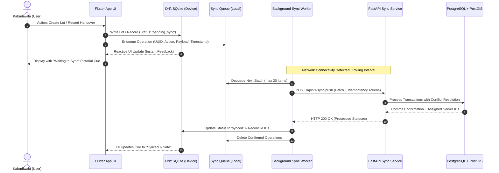

# Offline-First Strategy & Data Synchronization

In **Kabadiwala Connect**, offline capability is not a fallback—it is the foundational operating model. E-waste collectors (*kabadiwalas*) frequently operate in scrap yards, basements, rural collection points, and areas with spotty 2G/3G connectivity.

---

## 1. Local-First Data Flow

All user interactions commit immediately to the local device database first. The UI never blocks or fails due to network unreachability.



---

## 2. On-Device Storage Breakdown (Drift SQLite)

To keep APK size under **25 MB** and run smoothly on **2GB RAM** Android 8+ devices, storage is carefully partitioned:

| Domain | Table / Cache Name | Storage Retention | Size Budget |
| :--- | :--- | :--- | :--- |
| **Price Board** | `cached_prices` | Last valid downloaded rate board + 14-day stale tolerance | $\sim 50$ KB |
| **Authorized Recyclers** | `cached_recyclers` | Regional directory within 50 km radius | $\sim 200$ KB |
| **Offline Lots** | `collector_lots` | All un-synced lots + 90-day historical lots | $\sim 500$ KB |
| **Handover Records** | `handover_records` | Tamper-proof append-only handover receipts | $\sim 1$ MB |
| **Transaction Ledger** | `cash_ledger` | Running cash/credit ledger entries | $\sim 500$ KB |
| **Sync Operations** | `sync_queue` | FIFO outbound action payload queue | $< 100$ KB |
| **Compressed Media** | Internal app storage | Compressed images ($\le 200$ KB each, max 50 images cached) | $\le 10$ MB |
| **Audio Voice Prompts** | Local asset bundle | Pre-recorded vernacular snippets (.m4a / .ogg) | $\le 6$ MB |

---

## 3. Conflict Resolution Matrix

When the device reconciles with the backend via `/api/v1/sync/push` and `/api/v1/sync/pull`, deterministic resolution rules apply:

```
┌─────────────────────────────────┬──────────────────────┬────────────────────────────────────────────────────────┐
│ Domain                          │ Policy               │ Detailed Handling                                      │
├─────────────────────────────────┼──────────────────────┼────────────────────────────────────────────────────────┤
│ Price Boards                    │ Server-Wins          │ The latest server benchmark rates supersede local rates│
│                                 │                      │ upon sync. In-flight estimates retain their locked rate│
│                                 │                      │ if created within the valid rate window (24h).         │
├─────────────────────────────────┼──────────────────────┼────────────────────────────────────────────────────────┤
│ Authorized Recyclers Registry   │ Server-Wins          │ Recycler authorization status (CPCB/SPCB validity)     │
│                                 │                      │ is strictly controlled by the server. Suspended        │
│                                 │                      │ recyclers are updated immediately on next pull.        │
├─────────────────────────────────┼──────────────────────┼────────────────────────────────────────────────────────┤
│ Collector Lots (Created Offline)│ Client-Wins          │ Lots created offline with a local UUID are never       │
│                                 │                      │ overwritten or discarded by the server. The server     │
│                                 │                      │ accepts them, assigns a canonical reference ID, and    │
│                                 │                      │ updates the mobile app mapping.                        │
├─────────────────────────────────┼──────────────────────┼────────────────────────────────────────────────────────┤
│ Handover Records                │ Append-Only          │ Handover records are strictly immutable. Once signed/  │
│                                 │ (Tamper-Proof)       │ confirmed offline with photo hash and GPS, neither side│
│                                 │                      │ can alter the entry. Discrepancies generate a new      │
│                                 │                      │ dispute record rather than overwriting.                │
└─────────────────────────────────┴──────────────────────┴────────────────────────────────────────────────────────┘
```

---

## 4. Sync Queue & Exponential Backoff Algorithm

The sync engine uses an exponential backoff retry loop with randomized jitter to prevent "thundering herd" issues upon cellular network reconnection.

### Algorithm Specification:
1. **Initial Backoff ($t_0$):** 2 seconds.
2. **Backoff Multiplier ($\beta$):** 2.0.
3. **Maximum Backoff ($t_{\text{max}}$):** 60 seconds.
4. **Jitter ($\Delta$):** Uniform random distribution $\pm 25\%$.
5. **Formula:**
   $$t_{next} = \min\left(t_{\text{max}},\, t_0 \times \beta^{\text{attempt}}\right) \times (0.75 + 0.50 \times \text{rand}())$$

### Retry Triggers:
- **Immediate Retry On:** Transition from `ConnectivityResult.none` to `mobile` or `wifi`.
- **Transient Failures (HTTP 502, 503, 504, Timeout):** Retry with backoff up to 10 attempts.
- **Client Errors (HTTP 400, 422):** Quarantined to `dead_letter_queue` with error details; user is alerted via vernacular audio prompt.
- **Idempotency Guarantee:** Every push request contains `X-Client-Transaction-ID`. The server deduplicates duplicate submissions transparently.

---

## 5. Low-Literacy Visual Indicators for Sync States

Because users may have low literacy, text messages like *"Synchronization in progress..."* are avoided. Instead, clear, universally recognizable icons, color coding, and audio read-aloud buttons communicate status:

```
┌──────────────────┬─────────────────┬──────────┬─────────────────────────────────────────────────────────┐
│ State            │ Pictorial Icon  │ Color    │ Vernacular Audio Cue (Marathi / Hindi)                  │
├──────────────────┼─────────────────┼──────────┼─────────────────────────────────────────────────────────┤
│ Waiting to Sync  │ ☁️ + ⏳         │ Amber    │ "माहिती फोनमध्ये सुरक्षित आहे, इंटरनेट आल्यावर पाठवू."     │
│ (Offline Saved)  │ (Cloud + Clock) │ (#F59E0B)│ ("Data is safe in phone, will send when online.")       │
├──────────────────┼─────────────────┼──────────┼─────────────────────────────────────────────────────────┤
│ Syncing Now      │ 🔄              │ Blue     │ "माहिती पाठवत आहे..."                                   │
│                  │ (Spinning Cycle)│ (#3B82F6)│ ("Sending data...")                                     │
├──────────────────┼─────────────────┼──────────┼─────────────────────────────────────────────────────────┤
│ Successfully     │ 🟢 + 🛡️        │ Green    │ "काम पूर्ण झाले आणि सरकार/कंपनीकडे नोंद झाली."         │
│ Synced           │ (Check + Shield)│ (#10B981)│ ("Completed and registered with government/company.")   │
├──────────────────┼─────────────────┼──────────┼─────────────────────────────────────────────────────────┤
│ Attention Needed │ ⚠️ + 📢         │ Red      │ "कृपया स्पीकर दाबा, काहीतरी माहिती पुन्हा तपासा."       │
│                  │ (Alert + Horn)  │ (#EF4444)│ ("Please tap speaker, something needs verification.")   │
└──────────────────┴─────────────────┴──────────┴─────────────────────────────────────────────────────────┘
```

### UI Implementation Rules:
1. Every card displays the icon at top-right (size $\ge 32\text{dp}$).
2. Tapping any status badge triggers immediate audio playback in the user's selected language.
3. A persistent top-bar banner shows device status: Green Dot = Online, Amber Clock = Offline with pending items.
